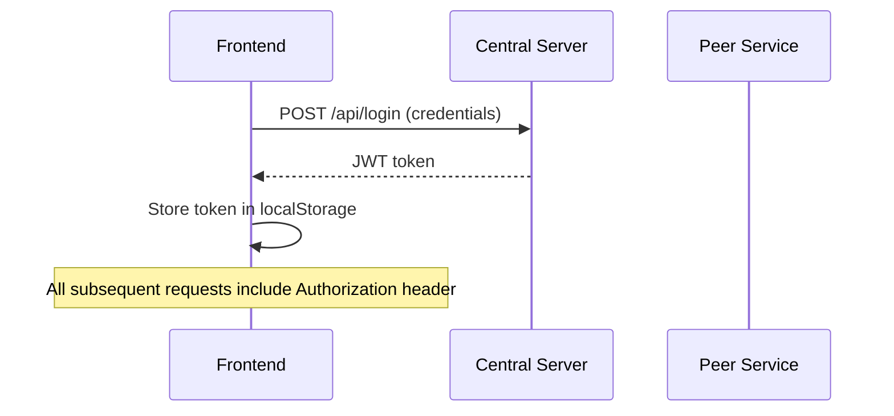
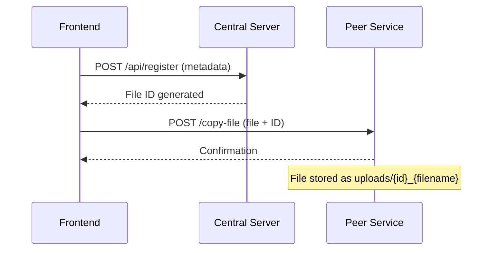
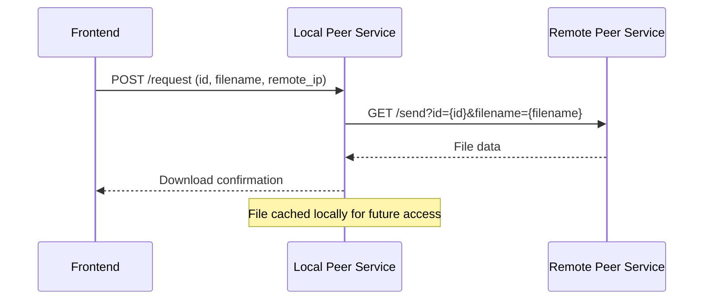
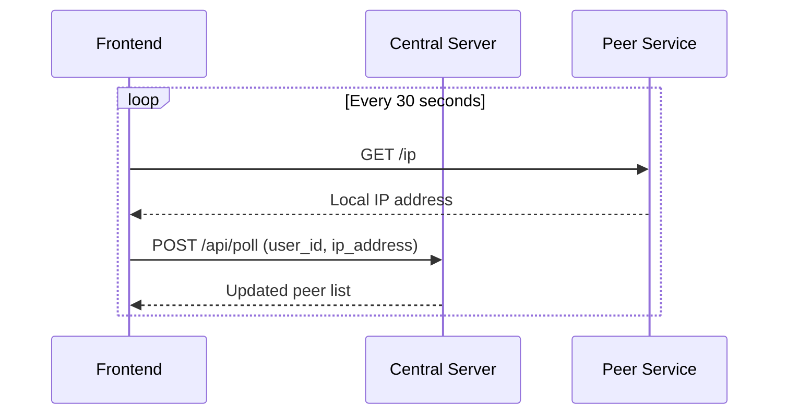

# PeerNotes - Decentralized Note Sharing Platform

A peer-to-peer note sharing platform designed for academic environments, enabling students to share and access educational resources across a local network.

## 🏗️ System Architecture

### Overview
PeerNotes is a **three-tier distributed system** that combines centralized metadata management with decentralized file storage:

```
┌─────────────────┐    ┌──────────────────┐    ┌─────────────────┐
│   Frontend      │    │  Central Server  │    │  Peer Services  │
│   (Next.js)     │◄──►│   (Node.js)      │◄──►│   (Node.js)     │
│   Port: 5173    │    │   Port: 8000     │    │   Port: 8080    │
└─────────────────┘    └──────────────────┘    └─────────────────┘
```

### Core Components

#### 1. **Frontend Application** (`frontend/`)
- **Technology Stack**: Next.js 14, React 18, TypeScript
- **Responsibilities**: User interface, authentication, file upload/download orchestration
- **Key Features**:
  - JWT-based authentication
  - Real-time polling for peer presence
  - File search and filtering
  - Upload/download management

#### 2. **Central Server** (`backend-node/`)
- **Technology Stack**: Node.js, Express.js, Sequelize ORM, SQLite
- **Responsibilities**: Metadata management, user authentication, search indexing
- **Database Schema**:
  - **Users**: Authentication and profile management
  - **Files**: Metadata tracking (filename, ownership, timestamps)
  - **Academic Entities**: Courses, Professors, Topics, Semesters
  - **Social Features**: Upvotes/downvotes, user reports, peer relationships

#### 3. **Peer Services** (`file_peer/`)
- **Technology Stack**: Node.js, Express.js, Multer (file handling)
- **Responsibilities**: Local file storage, peer-to-peer file transfer
- **Key Features**:
  - Automatic IP discovery
  - Direct peer file transfers
  - Local file management
  - Network-restricted operations

## 🔄 Data Flow Architecture

### Authentication Flow


### File Upload Flow


### File Download Flow


### Presence & Discovery


## 🗄️ Database Design

### Entity Relationships
```
Users (1) ←→ (N) Files
Files (1) ←→ (1) Topics
Files (1) ←→ (1) Professors  
Files (1) ←→ (1) Courses
Files (1) ←→ (1) Semesters

Users (N) ←→ (N) Files (Peer Hosting)
Users (N) ←→ (N) Files (Upvotes)
Users (N) ←→ (N) Files (Downvotes)
Users (1) ←→ (N) UserReports
```

### Key Models

#### File Model
```javascript
{
  filename: String,
  created_at: Date,
  is_disabled: Boolean,
  disabled_reason: String,
  original_author_id: ForeignKey(User),
  topic_id: ForeignKey(Topic),
  professor_id: ForeignKey(Professor),
  course_id: ForeignKey(Course),
  semester_id: ForeignKey(Semester)
}
```

#### User Model
- JWT-based authentication
- Profile management
- Peer relationship tracking
- Voting and reporting capabilities

## 🌐 Network Architecture

### Communication Protocols
- **HTTP/HTTPS**: RESTful API communication
- **Local Network**: Peer-to-peer file transfers
- **Polling**: Real-time presence updates (30-second intervals)

### Port Configuration
- **Frontend**: `5173` (Next.js dev server)
- **Central API**: `8000` (Express.js)
- **Peer Service**: `8080` (Express.js)

### Network Constraints
- **Local Network Only**: Designed for restricted network environments
- **IP-based Discovery**: Automatic LAN IP detection
- **Direct P2P**: Files transferred directly between peers

## 🔧 Technical Implementation Details

### Frontend Architecture
```
src/
├── app/
│   ├── (auth)/          # Authentication pages
│   └── (app)/           # Main application pages
├── components/          # Reusable UI components
├── hooks/              # Custom React hooks
├── utils/              # Utility functions
└── styles/             # CSS styling
```

### Backend Architecture
```
backend-node/
├── controllers/        # Request handlers
├── models/            # Sequelize models
├── routes/            # API route definitions
├── middleware/        # Custom middleware
├── config/           # Database configuration
└── migrations/       # Database migrations
```

### Peer Service Architecture
```
file_peer/
├── server.js          # Main peer service server
├── uploads/           # Local file storage
└── package.json       # Dependencies
```

## 🔐 Security Features

### Authentication
- JWT token-based authentication
- Token storage in localStorage
- Request-level authentication middleware

### File Security
- File ID-based access control
- Filename sanitization
- Upload size limits (50MB)
- Network-restricted access

### Data Validation
- Input sanitization across all endpoints
- SQL injection prevention via Sequelize ORM
- CORS configuration for cross-origin requests

## 🚀 Deployment Architecture

### Development Environment
```bash
# Three separate processes required:
1. Central API:    cd backend-node && npm start
2. Peer Service:   cd file_peer && npm start  
3. Frontend:       cd frontend && npm run dev
```

### Production Considerations
- **Domain Configuration**: Replace hardcoded localhost with production domains
- **Network Setup**: Ensure all services within same network
- **Database Scaling**: Consider PostgreSQL for production
- **File Storage**: Implement distributed file storage for scalability

##  System Limitations & Design Decisions

### Current Limitations
- **Network Restriction**: Only works within local networks
- **Single Point of Failure**: Central server dependency for metadata
- **File Duplication**: Multiple peers may store same file
- **No Version Control**: No file versioning system

### Design Trade-offs
- **Centralized Metadata**: Simplifies search and discovery vs fully decentralized
- **P2P File Transfer**: Reduces central server bandwidth costs
- **SQLite Database**: Lightweight for development vs production-ready alternatives
- **Polling vs WebSockets**: Simpler implementation vs real-time efficiency

## 🔮 Future Architecture Enhancements

### Scalability Improvements
- **Database Migration**: PostgreSQL for production workloads
- **Load Balancing**: Multiple central server instances
- **CDN Integration**: Global file distribution
- **WebSocket Implementation**: Real-time updates

### Feature Enhancements
- **File Versioning**: Track file revisions and history
- **Advanced Search**: Full-text search capabilities
- **Access Control**: Granular permission systems
- **Analytics**: Usage tracking and insights

## 🛠️ Development Workflow

### Code Organization
- **Feature Branches**: Isolated development per feature
- **Modular Architecture**: Clear separation of concerns
- **TypeScript**: Type safety across frontend
- **RESTful APIs**: Standardized API design

### Testing Strategy
- **Unit Tests**: Model and controller testing
- **Integration Tests**: API endpoint testing
- **E2E Tests**: Full user journey testing
- **Network Testing**: P2P transfer validation

---

## 📚 Quick Start Guide

For detailed setup instructions, see the [WALKTHROUGH.md](./WALKTHROUGH.md) file.

### Prerequisites
- Node.js 18+
- npm or yarn package manager
- Local network environment

### Installation
```bash
git clone <repository-url>
cd PeerNotes-main

# Install dependencies for all services
npm run install:all  # or install individually per directory
```

### Development
```bash
# Terminal 1: Central Server
cd backend-node && npm start

# Terminal 2: Peer Service  
cd file_peer && npm start

# Terminal 3: Frontend
cd frontend && npm run dev
```

Access the application at `http://localhost:5173`

